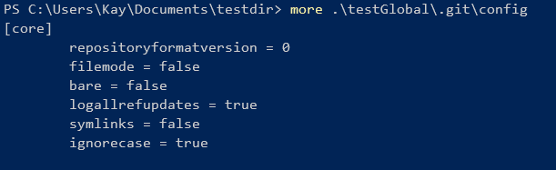
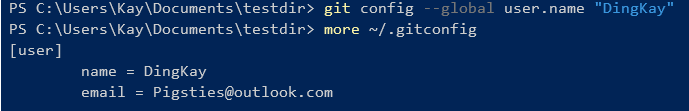

# Git

## Git 基础

### 初始化仓库

使用命令初始化testGlobal仓库；`git init <仓库名>`

查看当前初始化仓库的*gitconfig*配置（在项目目录下 *.git* 隐藏文件中的*config*）

查看*git*全局配置（*window*：用户目录下的*.gitconfig*文件）

### 修改config

`git config --global user.name`命令配置全局的*userName*

`git config --global user.email`配置全局的*email*

参数`--global`是修改全局的*.gitconfig*配置；

以此类推修改全局*email*配置；

