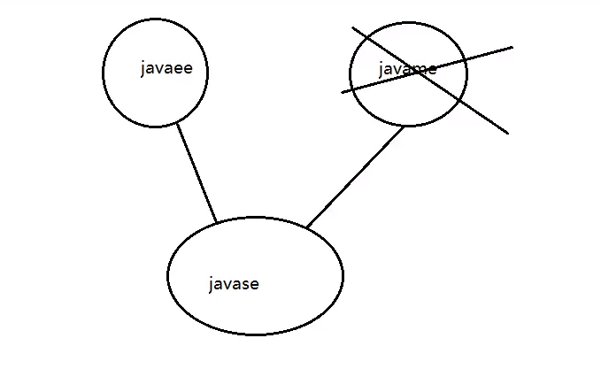

# Java

## 简单介绍一下Java

* Java 是一门简单易学，完全面向对象，安全可靠，与平台无关的编程语言。

> J2EE(Java Platform Enterprise Edition) 企业版：是为开发企业环境下的应用程序提供的一套解决方案。<br>
> J2ME(Java Platform Micro Edition) 小型版：是为开发电子消费产品和嵌入式设备提供的解决方案，主要体现于小型电子消费产品，如手机中的应用等。<br>
> J2SE(Java Platform Standard Edition) 标准版：该技术体系是其他两者的基础，可以完成一些桌面应用程序的开发。

<br>

* Java语言的特点：跨平台<br>
通过Java的编译器编译成了Class文件以后，在不同主机上面运行Java的执行文件时，由不同版本的JVM来处理Class文件。(所以是简介实现了跨平台，由不同版本的Jvm最终执行成不同系统所能识别的系统命令)<br>

<br>

* Java的编译流程<br>


一、 Java数据类型

* 基本数据类型

`byte short int long float double boolean char`

>1. 整数类型
>
>Byte 字节型 8位; 
>
>这里牵扯到计算机原理,在计算机中正整数用原码表示,负数用补码表示,补码等于反码加一；反码就是符号为不变,其余全部取反,而正整数的反码,补码都是其本身,1byte 八个字节 第一位0表示正整数 1复数后余七位用来表示数据, 最大值是 0111 1111 最小值是 1000 0000 是用补码的形式;
>
>Byte类型在大型数组中节约空间,主要代替整数,因为byte变量占用的空间只有int类型的四分之一; 默认值是 **0**
>
>Short 短整型 16位；默认值是 **0**
>
>Int 整型 32位；默认值是 **0**  Java中整型默认是int类型。
>
>Long 长整型 64位；默认值是 **0L** 因为小写的单词 `l` 容易和`1`混淆所以使用大写的 `L` 加以区分；
>
>2. 浮点类型
>
>Float 单精度 32位；默认值是 `0.0f`; 在Java中 `0.0` 默认为double类型
>
>浮点数不能用来表示精确的值，如货币；
>
>Double 双精度 64位 默认值是 `0.0d`;
>
>浮点数不能用来表示精确的值，如货币；
>
>浮点数只能用来科学计算或者工程计算，在商业计算中我们要用到java.math.BigDecimal 并且一定要用String来构造。
>
>3. 布尔类型:
>
>Boolean 取值为 True 或者 False 默认值是false  表示一位的信息
>
>在java中 布尔类型是不能参与运算的。
>
>4. 字符型
>
>Char 类型是一个单一的字符 16位的unicode字符；
>
>最小值是 **\u0000**（即为0）;
>
>最大值是 **\uffff**（即为65,535）;
>
>Char类型可以存储任何字符；

* 引用数据类型

`Java中除去基本数据类型 其余都是属于引用数据类型`

>`class`修饰的类,（类名首字母大写）`interface` 修饰接口
>
>对象类型都是引用数据类型
>
>String类型也就是字符串类型是引用类型 String类型和数组类型是特殊的类类型 在创建的时候可以不new String类型的数据不可改变是常量，final修饰的。String a ="a"  变量a存储在栈空间，"a"存储在常量池
>
>当a="b"时，在常量池中寻找"b"若没有则在常量池中创建一个"b" 若是String b=new String（"c"） 会在常量池中寻找"c"若常量池中没有，在常量池中创建"c" 并备份一个到堆内存中 操作的都是内存 则实际上创建了两个对象。

二、 Java运算符

* 比较运算符`> 大于 < 小于 <= 小于等于 >= 大于等于 == 等于 !=不等于` 	

>```java
>	int  a=10;
>	int  b=10;
>	//首先区别a,b的类型，如果是基本数据类型，==判断的是值
>	System.out.println(a==b);//true
>```
>
>```java
>	//java创建对象
>	Thread t1=new Thread();
>	Thread t2=new Thread();
>	//首先区别c1,c2的类型，如果是引用数据类型，==判断的是地址
>	System.out.println(t1==t2);//false
>	//String是个引用类型，String是java中唯一不需要new就可以创建对象的类
>```
>

---

Tips: 

1. Java是一个 *纯面向对象* 的语言，基于类的，也就是`class` 并且Java是一个编译型语言，运行Java需要先将`.java`文件编译成`.class`文件 Java真正运行的是这个`.class`文件 运行这个文件的是 *Java虚拟机* 也叫做**JVM**

  	 1. Java中类名首字母要大写

---

* 算术运算符 Java中布尔类型是不能够参加运算的,任何类型和字符串类型相加,执行的都是连接。数值类型和字符型进行运算时 字符型会隐式的转换为int 通过ASCII码
* 逻辑运算符 逻辑与运算符`&` `&&` 逻辑或运算符`|` `||`
* 赋值运算符 `=`
* 三元运算符 `a=a>b?a:b `如果`a>b a=b ; a<b  a=b`
* `Instanceof`运算符` a instanceof b` 对象`a`是不是`b`的实例化对象
* 位运算符 `>>` `<<`

三、 Java流程控制

* 分支语句：`if else`  `switch.. case` 如果没有`break`则继续向下执行

* 循环控制：`for` ` while ` `do..while` 无论条件是否满足,都会执行一次！

流程控制中的关键字：`continue`立即执行和判断循环的条件 直接下一轮循环`break `跳出当前循环，如果有多重循环嵌套使用return跳出所有循环。

补充：Label For

---

Tips：

1. (package)包的机制

通过包的命名来组织代码和功能模块。通过包名区分同名的类，更好的合理的组织代码。通过包名更好的命名功能模块，更好的规划代码。

规范： 所有的包名的字母全部小写。

​          `com.dk.nanjing.users`

Java所有的类首字母都是大写，Java所有的类都必须有包。

Java.lang 包默认自动导入，不需要导包。<br>

>当定义了多个类的时候，可能会发生类名的重复问题，在Java中采用包机制处理开发者定义的类名冲突问题。

使用包可以防止类文件冲突，也可以使源文件与类文件分离，便于软件最终发布。

    注意细节：

        1.一个Java类只能定义在一个包中；

        2.包语句肯定是描述类的第一条语句；

2. (import)导入包<br>
包机制会引发一个问题：有了包之后类每次都需要把包名和类名写全，这个时候，就可以采用使用import语句导入包，其格式为：

>import导入的包名.要使用的类名;
注意细节：

    1.如果想使用一个包中的许多类时，这是不需要多条的导入语句，使用“*”号通配符代表所有的类；

    2.使用“*”时不能导入包中的子类包的class文件；

    3.import语句可以是多条；


---

