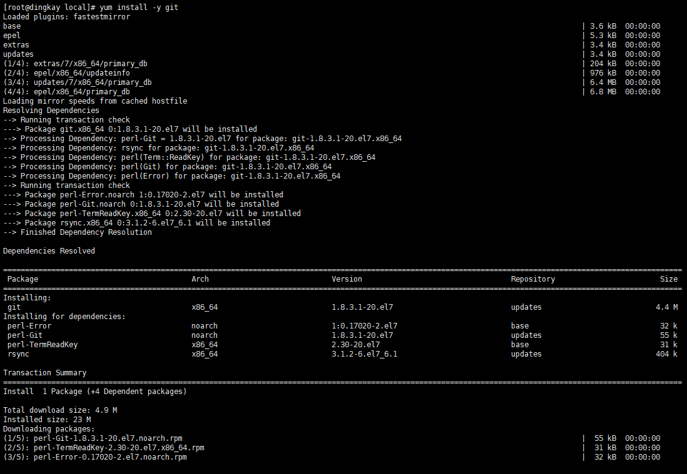
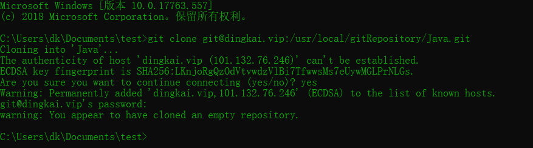
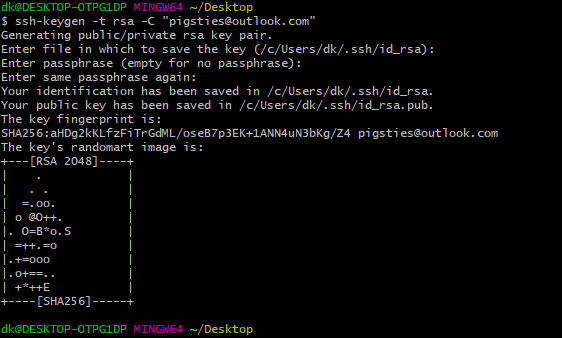
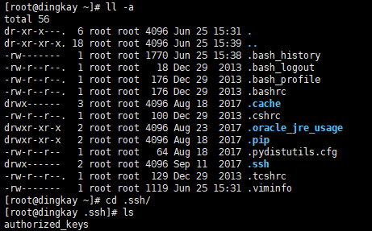
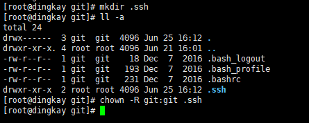
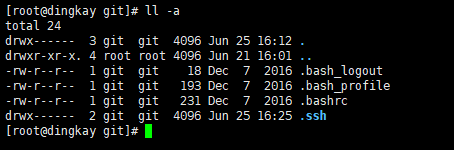
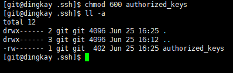

# Linux

## 常用

1.更改系统hostname 
> hostnamectl set-hostname `<new hostname>`

使用该命令修改`hostname` 并且重启生效 

修改后查看`hosts`文件 

该命令不会修改`/etc/hosts`文件中的`hostname`需要手动修改文件

---

2.搭建Git环境
> yum install -y git

使用 `yum` 命令安装 

安装后使用 `git --version` 查看版本信息 
 
则安装成功
 
则安装失败

查询是否存在用户,不存在则创建用户git用于仓库管理(UserName:git) 

创建文件夹,作为git的仓库

在git仓库目录下,再创建项目仓库目录 

> git init --bare `<fileName>`

初始化项目仓库并查看该文件权限 

目前该目录的权限是>root 用户 现在更改为>git 用户 

更改完毕后,本地进行`clone` 测试 

生成公钥以及密钥 

查看生成的`ssh`文件 

进入`ssh`目录更改服务端的`ssh`配置 
> cd /etc/ssh

> vim sshd_config

修改`ssh`配置文件,注释其中三条配置 

查看`sshd`服务的状态,并重启.此时,查看`~`目录下的`.ssh`目录

如果你需要把项目中的某一个文件夹作为项目目录，你需要把服务器上的公钥配置到git用户的权限之下，也就是我们创建的`git`用户的`.ssh`中的`authorized_keys`

创建git用户下的`.ssh`文件,并且修改权限组 

将本地之前生成的密钥上传至服务器 

服务器上查看`.ssh`目录 

修改权限很重要,使用`chmod 700 .ssh`命令修改目录权限,进入`.ssh`使用`chmod 600 authorized_keys`修改刚刚上传的认证密钥文件的权限 
修改后的:
 

现在从服务器上面`clone`就不需要密码了.
