# Golang基础

## Go简介

Go又称Golang，是Google开发的一种静态强类型、编译型、并发型，并具有垃圾回收功能的编程语言 -- 维基百科

Go语言的特点：语法简洁，开发效率高，执行性能好（天生支持并发）

## 安装环境

 Go官网下载地址：https://golang.org/dl/

 Go官方镜像站（推荐）：https://golang.google.cn/dl/

```
go语言迭代更新比较快，推荐使用较新的版本，体验新特性。
```

`go version` 查看Go当前版本号

### 配置环境变量

#### GOPATH、GOROOT

`GOPATH` 和 `GOROOT` 都是环境变量，其中，`GOROOT` 是安装Go的路径，而从Go 1.8 版本开始，Go安装包在安装完成后会为 `GOPATH` 设置一个默认目录，参见下表：

| 平台    | GOPATH默认值     | 举例               |
| ------- | ---------------- | ------------------ |
| Windows | %USERPROFILE%/go | C:\Users\用户名\go |
| Unix    | $HOME/go         | /home/用户名/go    |

 我们只需要记住默认的GOPATH路径在哪里就可以了，并且默认情况下 `GOROOT`下的bin目录及`GOPATH`下的bin目录都已经添加到环境变量中了，我们也不需要额外配置了。 

并且在Go 1.11 版本开始，`go mod` 的出现 `GOPATH` 的配置显得不那么重要了。

`GOPATH`路径下

`src`：用来存放源码文件， 任何使用 `go get` 命令安装的包也将驻留在这里 (*及其依赖包*)。 

`pkg`：用来存放编译后生成的归档文件，他们以 `.a` 作为文件扩展名 (**.a** 代表 ***存档***)。

`bin`：用来存放编译后生成的可执行文件（可以将此目录添加到`PATH`中）

#### GOPROXY

 Go 1.14版本之后，都推荐使用`go mod`模式来管理依赖环境了，也不再强制我们把代码必须写在`GOPATH`下面的src目录了，你可以在你电脑的任意位置编写go代码。（网上有些教程适用于1.11版本之前） 

 默认 `GOPROXY` 配置是：`GOPROXY=https://proxy.golang.org,direct`，由于国内访问不到`https://proxy.golang.org`，所以我们需要换一个PROXY，这里推荐使用`https://goproxy.io`或`https://goproxy.cn`。 

 可以执行下面的命令修改GOPROXY： 

```go
go env -w GOPROXY=https://goproxy.cn,direct
```

## Go项目结构

在进行Go语言开发的时候，我们的代码总是会保存在 `$GOPATH/src` 路径下。在工程经过 `go build` 、 `go install` 或 `go get` 等指令后，会将下载的第三方包源码文件放在 `$GOPATH/src` 目录下，产生的二进制可执行文件放在 `$GOPATH/bin` 目录下，生成的中间缓存文件会被保存在 `$GOPATH/pkg` 下。

如果我们使用版本管理工具（Version Control System，VCS，如：Git）来管理我们的项目代码时，我们只需要添加 `$GOPATH/src` 目录的源代码即可。`bin` 和 `pkg` 目录的内容无须版本控制。

### 个人开发

在 `$GOPATH/src` 路径下，创建项目一、项目二、项目三...

### 目前流行的项目架构

Go语言中也是通过包来组织代码文件，我们可以引用别人的包，也可以发布自己的包，但是为了防止不同包的项目名冲突，我们通常使用 `顶级域名` 来作为包名的前缀，这样就不用担心项目名冲突的问题了。

例如：`$GOPATH/src` 路径下创建 `github.com/dingkay/goProject`

```go
import "github.com/dingkay/goProject"
```

从GitHub上下载别人包的时候，执行：

```go
go get github.com/dingkay/goProject
```

那么，这个包会下载到我们本地 `$GOPATH/src/github.com/dingkay/goProject` 目录

### 企业开发

`$GOPATH/src/{公司域名}/{公司部门、组}/{项目名}/{module}`

## IDE

Go采用的是 `UTF-8` 编码的文本文件存放源代码，理论上使用任何一款文本编辑器都可以做Go语言的开发，推荐使用 `VS Code` 和 `Goland`

## 第一个Go程序

路径 `$GOPATH/src/github.com/dingkay/study/day01/helloworld` 下创建 `main.go` 文件，代码如下：

```go
package main

import (
	"fmt"
)

func main() {
	fmt.Println("Hello World!")
}
```

在项目路径下执行 `go build` 编译成二进制可执行文件

问题：执行build命令时提示：`go: cannot find main module; see 'go help modules'`

解决方案：由于设置了 `GO111MODULE=on`，所以需要初始化 go mod

执行：`go mod init {项目名}` 例如：`go mod init hello` 生成了一个 go.mod 文件，然后再执行编译命令，编译成功。

原因：为了提高下载依赖包的速度，配置了 `GOPROXY`，设置了配置如下：

```go
// 开启go mod依赖管理 on/off/auto
go env -w GO111MODULE=on
// 配置依赖下载代理
go env -w GOPROXY=https://goproxy.cn,direct
```

这使得Go默认管理依赖的方式变成了 go module 模式，即依赖一个 go.mod 文件，其中描述了项目依赖的包和版本（类似于npm package.json，Java的maven pom.xml）

而目录中没有 go.mod 文件，所以Go不知道主模块时什么，所以无法编译

 go语言在诞生之时，没有提供随之的包管理工具，而是使用 `go get` 来下载依赖包，并放在`$GOPATH/src`下，并且没有使用版本控制，每次都会拉取master分支的代码，软件包的代码放在src/github.com/xx/xx下面 

 而Go 1.11 版本及之后的版本引入了Go模块（Go Modules），Go Modules使用 go.mod 中标记的软件包的版本，软件包的代码放在 `pkg/mod` 下面

### 使用Go Modules 还是 GOPATH

 Go使用一个环境变量 `GO111MODULE` 来决定使用Go Modules还是GOPATH，该变量有三个值，并在不同版本下有不同的语义

| 配置               | 1.11版本&1.12版本                                            | 1.13版本及以后                                               |
| ------------------ | ------------------------------------------------------------ | ------------------------------------------------------------ |
| GO111MODULE = on   | 不管在GOPATH 中还是外，都强制使用go.mod                      | ~                                                            |
| GO111MODULE = off  | 强制 Go 表现出 GOPATH 方式，即使在 GOPATH 之外               | ~                                                            |
| GO111MODULE = auto | 在GOPATH外时，GO111MODULE = on，在GOPATH内时，GO111MODULE = off | 当有go.mod或者在GOPATH 之外，GO111MODULE = on，当处于 GOPATH 内且没有 go.mod 文件时，GO111MODULE = off |

### 程序编译

在项目路径下执行 `go build`

编译成功后，会在当前路径下生成一个可执行的二进制文件

Window下默认编译成 `.exe`，如果需要在Windows中编译Linux程序，可以修改 `GOOS`

#### 非项目路径下编译程序

在其他路径下执行`go build`，需要在命令后加上项目的路径（`$GOPATH/src` 路径可以省略）

例如，项目路径为：`$GOPATH/src/github.com/dingkay/study/day01/helloworld`

则打包命令为：`go build github.com/dingkay/study/day01/helloworld`

打包成功后，二进制可执行文件生成与执行命令的路径下

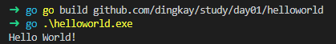

```
Tips:在非项目路径下执行 go build，需要将 GO111MODULE 修改为 off 或者 auto
```

#### 跨平台编译

在Windows平台下，编译Linux平台的执行程序，或者MacOS平台下的执行程序

将配置 `CGO_ENABLED=1` 修改为 `CGO_ENABLED=0` 不禁用CGO可能会导致一些问题

修改 `GOOS=linux` （MacOS为 `GOOS=darwin`）

修改处理器架构 `GOARCH=amd64`

执行编译命令，则编译出来的二进制文件为Linux平台下的程序

#### 编译时指定生成的文件名称

执行命令：`go build -o {文件名}`

### 常用命令

直接执行 go 程序：`go run {文件名}`，此命令不常用，推荐使用 `go build` 编译后再启动。

编译并将二进制程序复制到 `$GOPATH/bin` 路径中： `go install`，同样 `go install` 命令在非项目路径下执行，在命令后加上目路径即可。由于我们将 `$GOPATH/bin` 添加到了 `$PATH` 环境变量中，我们可以在任何路径下执行我们编译后的二进制可执行文件。

## 基本语法

### 包（package）

每一段 Go 程序都 **必须** 属于一个包。一个标准的可执行的 Go 程序必须有 `package main` 的声明。如果一段程序是属于 main 包的，那么当执行 `go install` 的时候就会将其生成二进制文件，当执行这个文件时，就会调用 main 函数。如果一段程序是属于 main 以外的其他包，那么当执行 `go install` 的时候，就会创建一个 `包管理` 文件。

```
包的声明并非一定要与包名同名。因此，你可能会发现很多包的包名（文件夹名）与其内部声明的名字是不同的。当引用包的时候，需要使用包的声明来作为引用变量。
```

执行 `go install` 后，首先会在当前目录寻找 ` package main` 包声明的文件，Go就会将其编译成可执行的二进制文件。并将其复制到 `$GOPATH/src/bin` 路径下，一个包里面有很多的文件，但只能有一个 `main` 函数，其标志着一个程序的入口。

```go
package main

import "fmt"

func main() {
	fmt.Println("pkg/main/main.go => print")
}
```

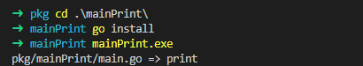

如果没有 `main` 包声明的文件，那么Go就会在 `$GOPATH/pkg` 路径下创建 `包管理` （后缀 `.a`）文件。

```go
package app

import "fmt"

func main() {
	fmt.Println("pkg/appPrint/app.go => print")
}
```

则 `$GOPATH/pkg/windows_amd64/github.com/dingkay/study/day01/pkg` 

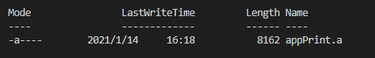

#### 包的命名规范

关于包的命名，Go 团队建议以简单，扁平为原则。例如， `strutils` 是 `string utility` 函数的名字， `http` 是 `HTTP` 请求的名字。

包的名字应避免使用下划线，中划线或掺杂大写字母。

#### 创建包

包分为两种：

可执行的包（main包）：可执行的包可以看作是主应用，编译后为可执行的程序。

工具包（非main包）：工具包自身是不可执行的，但是它会给主应用（可执行的包）增加一些功能，从而起到扩展主应用的作用。

#### 引用包

使用 `import`  语法引用包。Go 首先会在 `$GOROOT/src` 目录中搜索指定的包，如果找不到，再去 `$GOPATH/src` 目录中找。 `fmt` 包来自于Go的标准库，因此可以在 `$GOROOT/src` 路径中找到它。而不属于标准库中的包，在 `$GOROOT/src` 路径中找不到它，就会去 `$GOPATH/src` 中找

**greet**包

```go
package greet

var morning = "Good Morning"
var Morning = "Hey!" + morning
```

在main包中引入**greet**包

```go
package main

import (
	"fmt"

	"github.com/dingkay/study/day01/greet"
)

func main() {
	fmt.Println(greet.Morning)
}
```

引用包的方式主要有两种：

单独引包： `import "{packageName}"`

组合引包： `import ( "{packageName1}" "{packageName2}" "...")`

#### 包的访问权限

可以使用 `.` 符号来获取包的输出项，当一个包被引用的时候，Go会使用 `包的声明` 把这个包创建为全局变量。上述例子中，`greet` 就是全局变量，`greet.Morning` 可以直接访问输出项，但由于 `morning` 变量是 `greet` 包私有的， `greet.moring` 编译会报错，无法在包外访问私有的输出项。

##### 包的scope

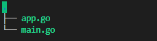

main.go

```go
package main

import "fmt"

func main() {
	fmt.Print("version ==> " + version)
}
```

app.go

```go
package main

var version = "1.0.0"
```

 **scope 是指代码块中可以访问已定义变量的区域**。包的 scope 是指在一个包中 (包括包里的所有文件) 可以访问已定义变量的区域。这个区域是包中所有文件的顶层块。 

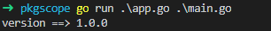 Go能够识别出应用的入口文件，因为它里面有 `main` 函数

尽管 `app.go` 文件中的 `version` 没有开头大写，但是我们依然可以在包内的任何地方访问它，因为它是在包的 scope 中声明的。如果 `version` 变量是在一个函数中声明的，那么它就不属于包的 scope 范畴，上面的程序就会出错。

**不可以在一个包中重复声明全局变量**。因此，一旦 `version` 声明了，在包的 scope 内，就不可以再次声明。但是你可以在 scope 以外的任何地方声明。

#### 包的嵌套

 可以在一个包中嵌套另一个包。因为在 Go 中，一个包就是一个目录，所谓嵌套，就相当于是在一个包中创建一个子目录。我们需要做的，就是指明其路径关系。 

```go
package main

import (
	"fmt"

	"github.com/dingkay/study/day01/pkgtest/pkg1"
	"github.com/dingkay/study/day01/pkgtest/pkg1/pkg2"
)

func main() {
	fmt.Println(pkg1.PkgMsg)
	fmt.Println(pkg2.PkgMsg)
}
```

输出结果：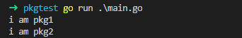

#### 包的别名

当引用包的时候，Go会根据包的声明来创建包的全局变量。如果引用多个重名包，就会导致冲突。

因此，我们需要使用 **包的别名**。在关键字 `import` 和包名之间，声明一个变量名，用以表示这个包。

```go
// pkgalias/greet
package greet

var Message = "i am pkgalias greet."
// pkgalias/greet/greet
package greet

var Message = "i am pkgalias/greet greet."
```

main.go

```go
package main

import (
	"fmt"

	_ "github.com/dingkay/study/day01/pkgalias/greet"
	subgreet "github.com/dingkay/study/day01/pkgalias/greet/greet"
)

func main() {
	fmt.Println(subgreet.Message)
}
```

在 Go 中，下划线是一个特殊的符号，表示 null 容器。如果我们引用了 greet 包，但是暂时没有用到它，Go 在编译的时候就会抱怨这个问题。为了避免这个问题，我们就可以把暂时用不到的引用放在 _ 中，这样编译器就会忽略它。

给一个包加上 **下划线** 别名看似没有意义，但其实在某些情况下还是很有用的，比如在包初始化时用不到的变量。

#### 安装第三方包

例如将包发布到 `github.com` 上，本地下载的命令：

```
go get -u github.com/dingkay/study-go
```

上面这个命令的意思是，从 `https://github.com/dingkay/study-go` URL中引用文件，并保存到 `%GOPATH/src/github.com/dingkay/study-go` 目录中。

### 变量初始化

如果变量 `a` 依赖 `b` ，那么就要先初始化变量 `b`，否则无法编译。Go在函数内部会遵循这个原则

```go
package main

func main() {
	var a int = b
	var b int = c
	var c int = 6
}
```

执行失败：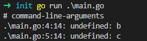

但是在包的 scope 中定义的变量，它们在初始化周期中就已经被声明了。

```go
package main

import "fmt"

var a int = b
var b int = c
var c int = 9

func main() {
	fmt.Print(a, b, c)
}
```

执行结果：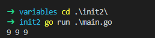

在上面的例子中，首先是变量 `c` 被赋值了。在下一个初始化周期时，变量 `b` 被赋值，因为它依赖于变量 `c`，而 `c` 已经被赋值了。在最后一次初始化周期中，变量 `a` 被赋予变量 `b` 的值。Go 可以处理复杂的初始化周期。

```go
package main

import "fmt"

var a int = b
var b int = f()
var c int = 2

func f() int {
	return c + 1
}

func main() {
	fmt.Print(a, b, c)
}
```

执行结果：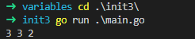

注意，要避免像下面这样递归式的初始化循环

```go
package main

import "fmt"

var a int = b
var b int = c
var c int = a

func main() {
	fmt.Print(a, b, c)
}
```

执行结果：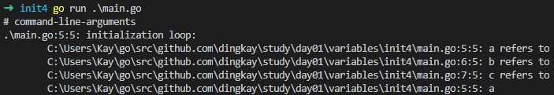

### Init 函数

跟 main 函数一样，当初始化包的时候，init 函数也会被执行。它没有参数，也没有返回值。init 函数是由 Go 来声明的，你无法引用这个函数（ 也不能用类似 *init()* 的方式调用它）。你可以在一个文件或一个包中定义多个 init 函数。在同一个文件中，init 函数是按照它们被定义的先后顺序被执行的。

```go
package main

import "fmt"

func init() {
	fmt.Println("main.go ==> init() [1]")
}

func init() {
	fmt.Println("main.go ==> init() [2]")
}

func init() {
	fmt.Println("main.go ==> init() [3]")
}

func main() {
	fmt.Println("main.go ==> main()")
}
```

执行结果：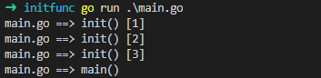

 你可以在包中的任何位置定义 `init` 函数。这些 `init` 函数以词法文件名的顺序（字母顺序）被调用。 

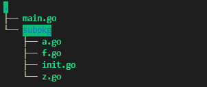

a.go

```go
package subpkg

import "fmt"

var Test string = ""

func init() {
	fmt.Println("init ==> a.go")
}
```

f.go/z.go 略

init.go  在main.go中引用，触发初始化包 scope

```go
package subpkg

var InitMsg = "started init"
```

main.go

```go
package main

import (
	"fmt"

	"github.com/dingkay/study/day01/initfunc/pkgscope/subpkg"
)

func main() {
	fmt.Print(subpkg.InitMsg)
}
```

执行结果：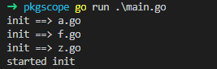

 当所有的 `init` 函数被执行以后，`main` 函数才会被执行。因此， `init` 函数 的主要工作就是，初始化无法在全局范围内初始化的全局变量** 。例如，初始化数组。 

```go
package main

import "fmt"

var arr [10]int

func init() {
	fmt.Println("main init arr")
	for i := 0; i < 10; i++ {
		arr[i] = i
	}
}

func main() {
	fmt.Println("main.go ==> start")
	fmt.Println(arr)
}
```

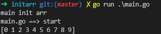

特别强调一点，**被引用的包只能被初始化一次**。因此，如果你在一个包中，要引入很多包，每个被引用的包都只能在 main 包的生命周期中被初始化一次。

### 程序执行顺序

```
go run *.go
├── 执行 Main 包
├── 初始化所有引用的包
|  ├── 初始化所有引用的包 (recursive definition)
|  ├── 初始化全局变量
|  └── 以词法文件名的顺序调用 init 函数
└── 初始化 Main 包
   ├── 初始化全局变量
   └── 以词法文件名的顺序调用 init 函数
```

下面是一小例子：

```go
//declaration/version/version.go
package version

import "fmt"

func init() {
	fmt.Println("version/version.go ==> init")
}

var Version = "v1.2.1"

//declaration/version/fetch.go
package version

import "fmt"

var FerchVersion = fetchVersion()

func init() {
	fmt.Println("version/ferch.go ==> init")
}

func fetchVersion() string {
	fmt.Println("version/fetch.go fetchVersion")
	return Version
}
**************************************************
//declaration/entry.go
package main

import (
	"fmt"

	"github.com/dingkay/study/day01/declaration/version"
)

func init() {
	fmt.Println("declartion/entry.go ==> init")
}

func getVersion() string {
	fmt.Println("declartion/entry.go getVersion")
	return version.Version
}
//declaration/main.go
package main

import "fmt"

func init() {
	fmt.Println("declartion/main.go ==> init")
}

var myVersion = getVersion()

func main() {
	fmt.Println("declartion/main.go myVersion => " + myVersion)
}
```

执行结果：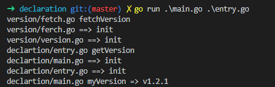

`go run main.go entry.go` 首先根据 `package main` 知道编译成可执行文件（` go run` 编译的可执行文件存放于临时目录中），再寻找 `main` 方法的入口，递归查找依赖的 **包**，初始化 `version` 包，`fetch.go` 以及 `fetch.go` 中的全局变量首先初始化，其次是根据**文件名**的字母顺序，依此执行 `init` 初始化方法，依此规则，向上初始化 `main` 包，由于 `entry.go` 文件中没有全局变量需要初始化，但 `main.go` 文件中的全局变量依赖 `entry.go` 中的方法，故打印的输出是 `entry.go` 中的 **getVersion**，变量初始化结束后，则依据规则初始化 `init`，最后执行 `main` 方法的输出。

### 注释

Go 的注释规则跟 `JavaScript` 或 `c++` 一样。单行注释用 `//comment`，多行注释用 `/*comment*/`。

```
// 单行注释
// 有一条单行注释

/*
    这里是多行注释。
*/
```

### 分号

Go 的语法也是用分号来标记一个语句的结局，但与 C 不同的是，分号不需要写在源码里。因为 Go 的 Lexer 程序会在扫描程序的时候，根据一定的规则自动插入分号。

插入分号的规则是，如果换行符之前的最后一个标记是标识符（ 包括像 *int* 和 *float64* ），普通的字符像 数字 或 字符串，或者下面标记中的任意一个

```
break continue fallthrough return ++ -- ) }
```

**Lexer** 就会在标记后面插入分号。一句话总结， “**如果换行符在可能结束语句的标记之后，则插入分号**”.

所以，Go 是不需要写分号的。如果你不小心写了分号，VSCode 插件也会在保存时把分号去掉。你也可以使用 [**gofmt**](https://golang.org/cmd/gofmt/) 命令来格式化代码。唯一需要用到分号的地方就是 switch 语句和 for 循环。因为必须用分号来明确指出在哪里结束语句。

例如：

```
package main

import (
	_ "fmt" _ "math"
)

func main() {}
```

`go build` 时，会提示缺少分号；

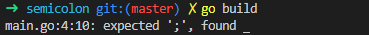

当 `_ "fmt" _ "math"` 分两行写时，或者在中间添加 `;` 标识，则可以通过编译

```go
package main

import(
    "fmt"                           // ;
    "math"                          // ;
)                                   // ;

func main() {
    fmt.Println(math.Sqrt(16))      // ;
}                                   // ;
```

Go 是一门非常注重简洁和系统性的语言。所以你的代码必须遵守社区准则和 Go 的规则。 [gofmt](https://golang.org/cmd/gofmt/) 是一个可以自动格式化代码的工具，可以帮助你书写更加规范的 Go 代码。

### 变量&数据类型

#### 什么是变量

 一个变量就是一个指定类型的存储单元。你可以给这个存储单元命名。变量定义时必须指定数据类型。例如， `string` 就是用于存储字符串的数据类型。 

#### 数据类型

Go包含很多种数据类型：

| 类型       | 说明                                                         | 默认值        |
| ---------- | ------------------------------------------------------------ | ------------- |
| bool       | 布尔类型。值为 `true` 或 `false`                             | false         |
| string     | 字符串类型。值为 `UTF-8` 编码的字符串，Go中所有的字符串的默认编码都是 `UTF-8`。与 `JavaScript` 不同，只有字符串可以用双引号。 | `''` 空字符串 |
| int        | 整型。值为 `32-bit` 或 `64-bit` 的整数。系统会为 `32-bit` 分配 `32` 个子节的内存空间。为 `64-bit` 分配 `64` 个子节的内存空间。因此， `32-bit` 可以存储 `-2147483648 ~ 2147483647` （-2的31次方 ~ 2的31次方 - 1）的数字，而 `64-bit` 可以存储 `-9223372036854775808 ~ 9223372036854775807` （-2的63次方 ~ 2的63次方-1）的数字；分配 `32-bit` 或者 `64-bit` 是根据系统而定的； | 0             |
| uint       | 整型。与 `int` 一样， `uint` 也能存储 32 个字节或 64 个字节，但是是**非负值** 的整数。 | 0             |
| int8       | 整型。 系统会分配 8 个字节的内存来存储整数。因此，能够存储 -128 到 127 的数字。 | 0             |
| uint8      | 整型。与 `int8` 一样，`uint8` 能够存储 8 个字节的 **非负值** 整数。 因此，它能够存储的数字是 0 到 255。 | 0             |
| int16      | 整型。系统会为其分配 16 个字节的存储空间用于存储整数。因此，它能够存储 -32768 到 32767 的数字。 | 0             |
| uint16     | 整型。 与 `int16` 一样，`uint16` 能够存储 8 个字节的 **非负值** 整数。 因此，它能够存储的数字是 0 到 65535。 | 0             |
| int32      | 整型。 系统会分配 32 个字节的内存来存储整数。因此，能够存储 -2147483648 到 2147483647 的数字。 | 0             |
| uint32     | 整型。 与 `int32` 一样，`uint32` 能够存储 32 个字节的 **非负值** 整数。 因此，它能够存储的数字是 0 到 4294967295 的数字。 | 0             |
| int64      | 整型。 系统会分配 64 个字节的内存来存储整数。因此，能够存储 -9223372036854775808 到 922337203685477580 的数字。 | 0             |
| uint64     | 整型。 与 `int64` 一样，`uint64` 能够存储 64 个字节的 **非负值** 整数。 因此，它能够存储的数字是 0 到 18446744073709551615。 | 0             |
| float32    | 浮点型。系统会为其分配 32 个字节的内存空间用来存储浮点数。因此，它能够存储的数值是 -3.4E+38 到 +3.4E+38。 | 0             |
| float64    | 浮点型。系统会为其分配 64 个字节的内存空间用来存储浮点数。因此，它能够存储的数值是 -1.7E+308 到 +1.7E+308。 | 0             |
| complex64  | Go 还支持复合数据类型。 `complex64` 由 `float32` 的实数部分和 `float32` 的虚数部分构成。 | 0+0i          |
| complex128 | 与 `complex64` 类似，`complex128` 由 `float64` 的实数部分和 `float64` 的虚数部分构成。 | 0+0i          |
| byte       | `uint8` 的别名。                                             | 0             |
| rune       | `int32` 的别名。它代表一个 Unicode 字符。                    | 0             |

#### 零值

在其他编程语言中，对于未初始化的变量，系统会赋予其 `null` 或者 `undefined`，在 go 中， 则是赋给这些变量符合其数据类型的零值。参照上表，布尔类型的变量就会被赋值为 `false`，整形变量会被赋值为 `0`。


#### 标识符

Go语言中标识符由字母数字和`_`(下划线）组成，并且只能以字母和`_`开头。 举几个例子：`abc`, `_`, `_123`, `a123`。

Go语言中有25个关键字：

```go
    break        default      func         interface    select
    case         defer        go          map        struct
    chan         else         goto        package      switch
    const        fallthrough    if          range        type
    continue      for         import       return       var
```

此外，Go语言中还有37个保留字：

```
    Constants:    true  false  iota  nil

       Types:    int  int8  int16  int32  int64  
               uint  uint8  uint16  uint32  uint64  uintptr
               float32  float64  complex128  complex64
               bool  byte  rune  string  error

    Functions:   make  len  cap  new  append  copy  close  delete
                 complex  real  imag
                 panic  recover
```

#### 变量

Go语言中的变量需要声明后才能使用，同一作用域内不支持重复声明。 并且Go语言的变量 `声明后必须使用`。

##### 标准声明

标准的声明格式如下：

`var 变量名 数据类型 = 值` 使用关键字 `var` 声明变量

