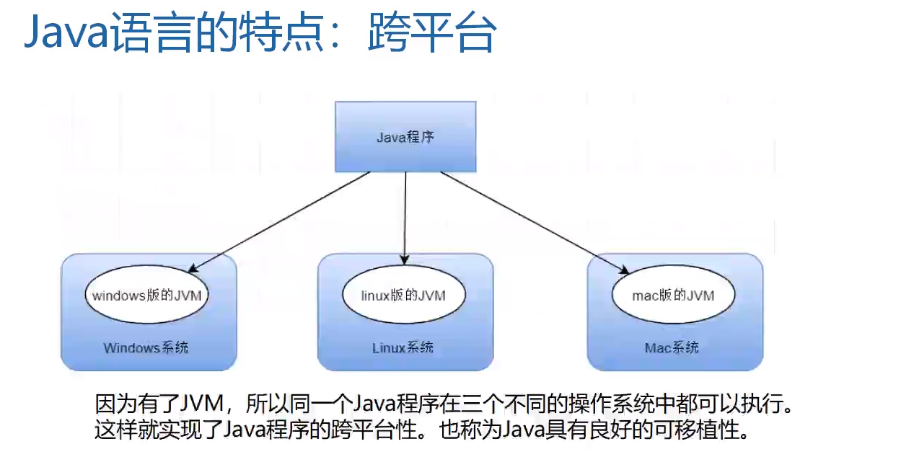
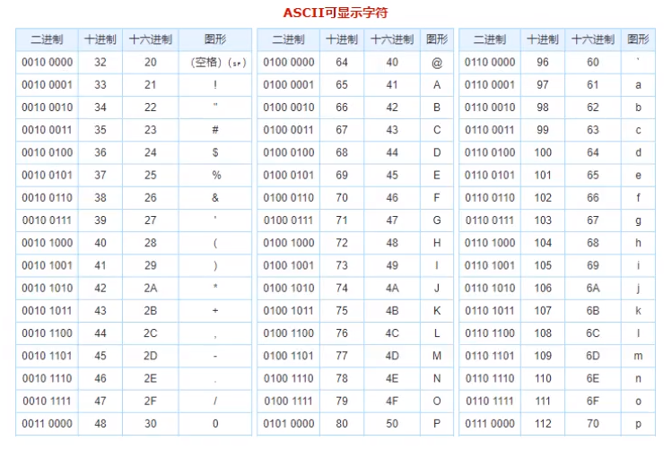
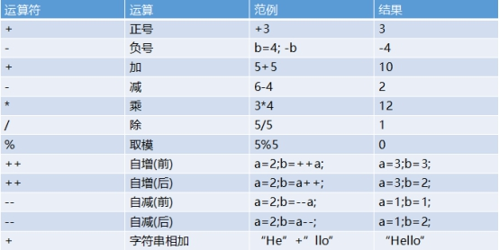

# Java

## 简介

* Java 是一门简单易学，完全面向对象，安全可靠，与平台无关的编程语言。

> J2EE(Java Platform Enterprise Edition) 企业版：是为开发企业环境下的应用程序提供的一套解决方案。<br>
> J2ME(Java Platform Micro Edition) 小型版：是为开发电子消费产品和嵌入式设备提供的解决方案，主要体现于小型电子消费产品，如手机中的应用等。<br>
> J2SE(Java Platform Standard Edition) 标准版：该技术体系是其他两者的基础，可以完成一些桌面应用程序的开发。

* Java语言的特点：跨平台<br>
通过Java的编译器编译成了Class文件以后，在不同主机上面运行Java的执行文件时，由不同版本的JVM来处理Class文件。(所以是简介实现了跨平台，由不同版本的Jvm最终执行成不同系统所能识别的系统命令)<br>

<br>

* Java的编译流程<br>


---

Tips: 

​	Java是一个 *纯面向对象* 的语言，基于类的，也就是`class` 并且Java是一个编译型语言，运行Java需要先将`.java`文件编译成`.class`文件 Java真正运行的是这个`.class`文件 运行这个文件的是 *Java虚拟机* 也叫做**JVM**

## Java入门
### 关键字
Java关键字，被Java语言赋予了特殊的含义的单词，并且作为保留字，不可以被用户作为其他变量、方法、类名使用。<br>
其特点是：*关键字的字母都为小写*。

> Java保留关键字，用于定义Java的基本数据类型变量的数据类型关键字<br>
    `class interface byte short int long folat double char boolean void`

> 而那些用于赋予数据类型值的保留关键字<br>
    `false true null`

> 虽然Java是一个面向对象的语言，但是流程控制语句也不可缺少，所以流程控制语句的关键字<br>
    `if else switch case default while do for break continue return`

> 用于修饰访问权限的关键字<br>
    `private protected public`

> 常见的修饰符关键字<br>
    `abstract final static synchronized`

> 用于定义类与类之间的关系的关键字有<br>
    `extends implements`

> 创建实例对象以及判断是否时该对象的实例的保留关键字有<br>
    `new this super instanceof`

> Java中异常处理所使用的关键字有<br>
    `try catch finally throw throws`

> 创建包、导入包所使用的关键字<br>
    `package import`

> 其他修饰符关键字，使用场景较少<br>
    `native strictfp transient`

*注意*：
`main`不是关键字，`main`只是一个标识符，不过有点特殊，虚拟机可以识别。<br>
`main`（主函数）的作用
1. 可以保证程序的独立运行
2. 是程序的执行入口
3. 可以被Java虚拟机（`JVM`）所识别
`main`方法不是必须要在类中定义的，如果想要运行这个类，需要添加。否则不需要。

### 标识符
在程序中自定义的一些名称，由26个英文字母大小写，数字：`0-9` 符号：`_ $`组成

合法标识符的定义规则：<br>
1：数字不可以开头<br>
2：不可以使用关键字<br>
注意：Java中严格区分大小写<br>
    `min, Min, MIn, MIN`属于4个完全不同的标识符<br>
    可以使用中文做为标识符，但是不推荐<br>
    在起名字的时候，为了提高阅读性，要尽量有意义<br>
    **使用驼峰命名法**。

### 命名规范
包名：多单词组成时所有字母都小写，并且以单数形式存在。`xxxyyyzzz`

类名、接口名：多单词组成时，所有的单词首字母大写 `XxxYyyZzz`

变量名和函数名：多单词组成时，第一个单词首字母小写，第二个单词开始每个单词首字母大写 `xxxYyyZzz`

常量名：所有字母都大写。多单词时每个单词用下划线连接 `XXX_YYY_ZZZ`

### 注释
用于解是程序功能的文字就是注释<br>
注释的作用主要有2点<br>
1：方便自己和他人理解这段代码<br>
2：暂时屏蔽不想参与编译的代码

Java中的注释格式:<br>
单行注释    格式：`//注释文字`<br>
多行注释    格式：`/* 注释文字 */`<br>
文档注释    格式：`/** 注释文字*/`<br>

对于单行和多行注释，被注释的文字，不会被JVM(Java虚拟机)解释执行。<br>
对于文档注释，是Java特有的注释，其中注释内容可以被JDK提供的工具`javadoc`所解析，生成一套以网页文件形式体现的该程序的说明文档。<br>
注释是一个程序员必须要具有的良好编程习惯<br>
初学者编写程序可以养成习惯：先注释再写代码<br>
将自己的思想通过注释先整理出来，再用代码去体现。<br>
因为代码仅仅是思想的一种体现形式而已。<br>

## Java数据基础

### 基本数据类型


`byte short int long float double boolean char`

>1.整数类型
>
>Byte 字节型 8位; 取值范围：`-2的7次方~2的7次方-1`
>
>这里牵扯到计算机原理,在计算机中正整数用原码表示,负数用补码表示,补码等于反码加一；反码就是符号为不变,其余全部取反,而正整数的反码,补码都是其本身,1byte 八个字节 第一位0表示正整数 1复数后余七位用来表示数据, 最大值是 0111 1111 (127)最小值是 1000 0000 (-128) 是用补码的形式;
>
>Byte类型在大型数组中节约空间,主要代替整数,因为byte变量占用的空间只有int类型的四分之一; 默认值是 **0**
>
>Short 短整型 16位；默认值是 **0** 取值范围：`-2的15次方~2的15次方-1`
>
>Int 整型 32位；默认值是 **0**  Java中整型默认是int类型。 取值范围：`-2的31次方~2的31次方-1`
>
>Long 长整型 64位；默认值是 **0L** 因为小写的单词 `l` 容易和`1`混淆所以使用大写的 `L` 加以区分； 取值范围：`-2的63次方~2的63次方-1`
>
>2.浮点类型
>
>Float 单精度 32位；默认值是 `0.0f`; 在Java中 `0.0` 默认为double类型
>
>浮点数不能用来表示精确的值，如货币；
>
>Double 双精度 64位 默认值是 `0.0d`;
>
>浮点数不能用来表示精确的值，如货币；
>
>浮点数只能用来科学计算或者工程计算，在商业计算中我们要用到java.math.BigDecimal 并且一定要用String来构造。

对于以上的数值型的变量，Java中可以隐式的类型转换，从精度小的转换成精度大的。<br>
例如：`int 1 > float 1.0f`<br>
    `char 'a' > int 97`<br>
但是不可以从大精度转换成小精度，如果需要这样做，需要强制类型转换，并且存在数值表达不准确，即失丢失精度。
例如：`(byte)int 10 > byte 10`<br>

 **隐式(自动)类型转换的前提是保证数据的完整的情况下** 

```java
byte var1 = 1, var2 = 2, var3, tmp;
// tmp = var1 + var2; 编译异常,Java编译时不能确定变量var1,var2相加的值是否会超出byte类型的存储上限
tmp = 1 + 2;
```


>3.布尔类型:
>
>Boolean 取值为 True 或者 False 默认值是false  表示一位的信息
>
>在Java中 布尔类型是不能参与运算的。
>
>4.字符型
>
>Char 类型是一个单一的字符 16位的unicode字符；
>
>最小值是 **\u0000**（即为0）;
>
>最大值是 **\uffff**（即为65,535）;
>
>Char类型可以存储任何字符，在跟数值类型运算时，会隐式的根据`ASCII`码转换成数值再运算；

```java
System.out.println("exampleCharValue : \\u0023 => " + exampleCharValue);
out:exampleCharValue : \u0023 => #
```

以下是一张`ASCII`码表：<br>


### 引用数据类型

`Java中除去基本数据类型 其余都是属于引用数据类型`

>`class`修饰的类,（类名首字母大写）`interface` 修饰接口
>
>对象类型都是引用数据类型
>
>String类型也就是字符串类型是引用类型 String类型和数组类型是特殊的类类型 在创建的时候可以不new String类型的数据不可改变是常量，final修饰的。String a ="a"  变量a存储在栈空间，"a"存储在常量池
>
>当a="b"时，在常量池中寻找"b"若没有则在常量池中创建一个"b" 若是String b=new String（"c"） 会在常量池中寻找"c"若常量池中没有，在常量池中创建"c" 并备份一个到堆内存中 操作的都是内存 则实际上创建了两个对象。

Java中有一个特殊的常量`null`<br>
只有一个数值就是：`null`它可以被转换成任意的引用类型。

以下是一张再Java中定义变量开辟的内存概念图<br>


### 运算符



* 比较运算符`> 大于 < 小于 <= 小于等于 >= 大于等于 == 等于 !=不等于` 	

>```java
>	int  a=10;
>	int  b=10;
>	// 首先区别a,b的类型，如果是基本数据类型，==判断的是值
>	System.out.println(a==b);//true
>```
>
>```java
>	// java创建对象
>	Thread t1=new Thread();
>	Thread t2=new Thread();
>	// 首先区别c1,c2的类型，如果是引用数据类型，==判断的是地址
>	System.out.println(t1==t2);//false
>	// String是个引用类型，String是java中唯一不需要new就可以创建对象的类
>```
>


* 算术运算符 Java中布尔类型是不能够参加运算的,任何类型和字符串类型相加,执行的都是连接。数值类型和字符型进行运算时 字符型会隐式的转换为int 通过ASCII码

```java
// 例子:
int value120 = 120;
value120 = value120 / 100; // int类型没有小数，舍去0.2
System.out.println(value120);
out:1
// 例子2:
float value130 = 130F;
value130 = value130 / 100;
System.out.println(value130);
out:1.3
// 例子3:
int tmp = 3%2;
// 任何正整数取模2的结果不是0就是1，可以用来判断奇偶数
```

* 自增/自减运算符

```java
int var1 = 1;
int var2 = 3;
System.out.println(2 * var1++ + (var1 + 2) + ++var2 * 2);
out:14
// (2 * 1) -> var1 = 2;
// (2 + 2)
// var2 = 4 -> (4 * 2)
```

`++`在前，先自增再运算，在后则先运算后自增；`--`同理；

* 逻辑运算符 逻辑与运算符`&` `&&` 逻辑或运算符`|` `||`

```java
// 例子:
boolean booFalse = false;
int tmp = 0;
if (booFalse & (tmp += 2) > 5 ) {
		System.out.println("Yes");
	} else {
		System.out.println("No");
	}
	System.out.println("tmp => " + tmp);
out:NO
	tmp => 2
// 在if判断的条件中，因为booFalse为false，此时的if判断的结果必然是False，会输出NO
// 但是依然去执行并判断了 & 后的 (tmp += 2) > 5 的语句，即使这段的结果是true或者false，对于我们的if判断结果不会产生影响
// 例子2:
if (booFalse && (tmp += 2) > 5 ) {
		System.out.println("Yes");
	} else {
		System.out.println("No");
	}
System.out.println("tmp => " + tmp);
out:NO
	tmp => 0
// 变量默认值与上例中相同，但结果却不相同
// 这次tmp的值没有改变，说明if判断中 && 后的 (tmp += 2 > 5) 并没有执行
// 逻辑或运算符 | 与 ||同理
```

`&&`俗称短路逻辑与，当第一个足以证明该判断是否`true/false`时，不会执行`&&`后面的运算/判断；

`||`同理；`&`和`|`则是会全部执行完；

* 赋值运算符 `= += -=`

```java
byte test = 2;
test += 3;
// test = test + 3; 编译失败，test + 3 需要强转，数值 3 默认是 int类型
```

`+=`会自动进行类型转换，不用人为操作转换（强转）

* 三元运算符 `a=a>b?a:b `如果`a>b a=b ; a<b  a=b`
* 逻辑与/或/非/取反 `& | ^ ~`

```java
例子:
int a = 3;// 3 -> 0000 0011
int b = 2;// 2 -> 0000 0010
System.out.println(a & b);
out:2
例子2:
int a1 = 3;
int b1 = 2;
System.out.println(a1 | b1);
out:3
例子3:
int tmp = 3;// 3 -> 0000 0011 -> 1111 1100 -> [补] 1000 0100 -> -4
System.out.println(~tmp);
out:-4
例子4:
int a2 = 3;
int b2 = 2;
System.out.println(a2 ^ b2);
out:1
// [思考]两个变量互换值,不能引入第三方变量；
思路1:
int a = 3;
int b = 6;
a = a + b;
b = a - b;
a = a - b;
// 当a,b为大数时，a+b会造成int类型溢出
思路2:
int a = 3; // 0000 0011 -> 3
int b = 6; // 0000 0110 -> 6
a = a ^ b; // 0000 0101 -> 5
b = a ^ b; // 0000 0011 -> 3
a = a ^ b; // 0000 0110 -> 6
// 使用异或运算符
```

* `Instanceof`运算符` a instanceof b` 对象`a`是不是`b`的实例化对象
* 位运算符 `>> 右移` `<< 左移动` `<<< 无符号右移` `>>> 无符号左移`

注意：
```
System.out.println('a');
System.out.println('a' + 1);
		
System.out.println("a" + 1);
System.out.println("a" + 1 + 1);

a
98
a1
a11
```
字符串和任何数据做 `+` 运算，都不是加法的含义，这个 `+` 号是一个连接符，任何数据和字符串相连接，都会变成一个新的字符串。可以看作是`+`重载，当两边是数值型或者字符型，进行算数运算（字符型先根据ASCII表转换），当存在字符串时，进行字符串拼接操作<br>
单引号是代表字符，而不是字符串。<br>

```java
boolean trueValue = true;
int value10 = 10;
// value10 += trueValue;编译异常，boolean类型不能进行operator + 运算
```


三、 Java流程控制

* 分支语句：`if else`  `switch.. case` 如果没有`break`则继续向下执行

* 循环控制：`for` ` while ` `do..while` 无论条件是否满足,都会执行一次！

流程控制中的关键字：`continue`立即执行和判断循环的条件 直接下一轮循环`break `跳出当前循环，如果有多重循环嵌套使用return跳出所有循环。

补充：Label For

---

Tips：

1. (package)包的机制

通过包的命名来组织代码和功能模块。通过包名区分同名的类，更好的合理的组织代码。通过包名更好的命名功能模块，更好的规划代码。

规范： 所有的包名的字母全部小写。

​          `com.dk.nanjing.users`

Java所有的类首字母都是大写，Java所有的类都必须有包。

Java.lang 包默认自动导入，不需要导包。<br>

>当定义了多个类的时候，可能会发生类名的重复问题，在Java中采用包机制处理开发者定义的类名冲突问题。

使用包可以防止类文件冲突，也可以使源文件与类文件分离，便于软件最终发布。

    注意细节：
    
        1.一个Java类只能定义在一个包中；
    
        2.包语句肯定是描述类的第一条语句；

* 1.1 (import)导入包<br>
包机制会引发一个问题：有了包之后类每次都需要把包名和类名写全，这个时候，就可以采用使用import语句导入包，其格式为：

  >import导入的包名.要使用的类名;
注意细节：

    1.如果想使用一个包中的许多类时，这是不需要多条的导入语句，使用“*”号通配符代表所有的类；

    2.使用“*”时不能导入包中的子类包的class文件；

    3.import语句可以是多条；

2. jar包<br>
jar包概述
    jar文件是一种打包文件java active File，与zip兼容，称之为jar包。开发了很多类需要将类提供给别人使用，通常以jar包形式提供。

    >注意：jar包提供的是类的class字节码文件。
jar命令

    jar工具存放于jdk的bin目录中，名称为`"jar.exe"`；

    通常jar打包命令如下：

    >jarcvf 要打包的包名 cn
---

